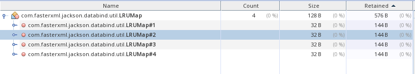
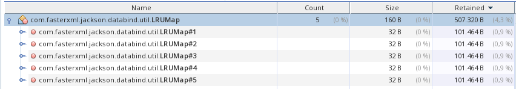
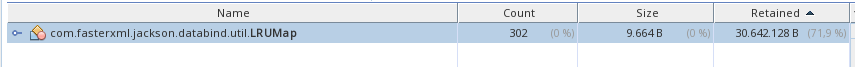

# Jackson GraalVM 2.14.0 heap usage

Reproducer to show that Jackson 2.14.0 uses a lot more heap in a native-image compared to 2.13.4.2.

The main problem appears to be the `LRUmap` which is backed by a `PrivateMaxEntriesMap` in 2.14.0. It contains a lot
of `AtomicReferences` in the `readBuffers` field.

2.13.4.2:

2.14.0:

You can see that 2.13.4.2 uses 576 B of heap, while 2.14.0 uses 507 KB of heap. Note that this is an
empty `ObjectMapper`.

This cache is per ObjectMapper: create 100 of them, and you'll use 100x the heap:

## Reproduce

1. Make sure you have a GraalVM distribution installed (`sdk install java 22.3.r17-nik`)
2. Comment in the Jackson version you want to test in `build.gradle`
3. Run `./gradlew nativeCompile`
4. Run ` build/native/nativeCompile/gradle-graalvm-skeleton 1` (the argument `1` is the number of `ObjectMapper`
   instances to create)
5. It creates a heapdump named `jackson-*.hprof` in the current directory
